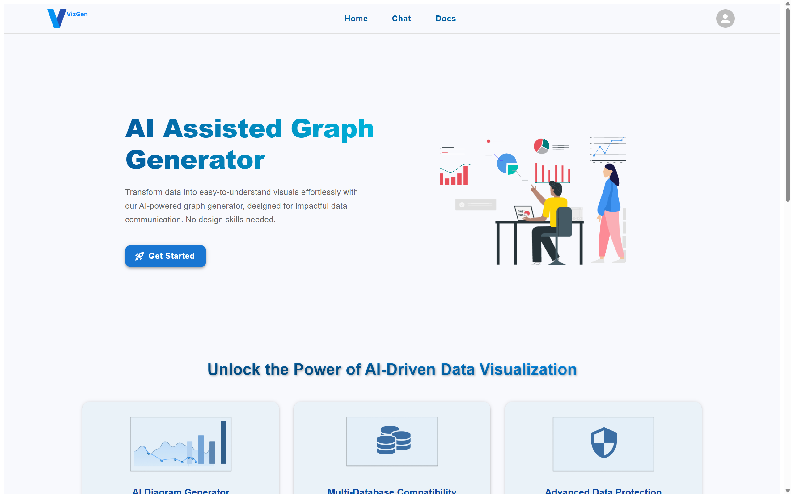
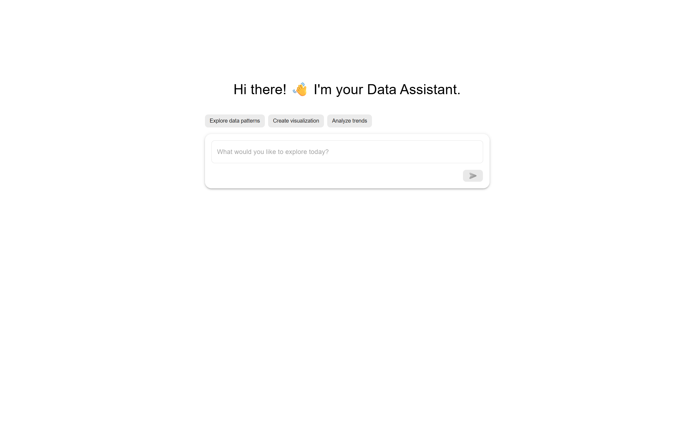
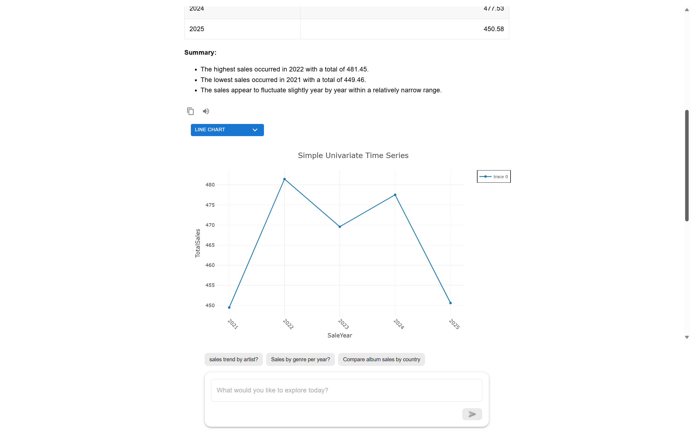

# VizGen – AI-Assisted Graph Generator

> 🌐 Natural Language to Visualization Platform powered by Multi-Agent AI.

VizGen is a cutting-edge AI-powered web application that allows users to generate intelligent, real-time graphs from natural language prompts. Designed for both technical and non-technical users, it supports seamless SQL database connections, automated chart recommendations, and deep data insight generation.

---

## ✨ Key Features

- 🧠 **Text-to-Graph**: Convert natural language queries into visual charts using advanced LLMs (Claude 3.7 Sonnet & Gemini 2.0 Flash).
- 🤖 **Multi-Agent Architecture**: Specialized agents handle query generation, graph recommendation, insights, and explanation.
- 📊 **AI-Driven Graph Recommendations**: Suggests the best graph types based on data patterns and user intent.
- ⚡ **Real-Time Interaction**: Connect live databases, auto-refresh graphs, and interact dynamically.
- 🧩 **Schema-Free Operation**: Works with any SQL database without prior schema knowledge.
- 🗃️ **User Preferences & History**: Stores connection settings and user feedback for personalized experiences.
- 🔐 **JWT-Based Authentication**: Supports login, signup, and secure OAuth integration.
- 🎨 **Interactive UI**: Built with React, Material UI, and framer-motion for a smooth experience.

---

## 🧰 Tech Stack

### 🔷 Frontend

- React.js + Material UI
- framer-motion for animations
- Plotly.js for graph rendering

### 🔶 Backend

- FastAPI (Python) with async support
- LangChain, LangGraph, LangSmith
- Claude 3.7 Sonnet, Gemini 2.0 Flash for LLM processing
- MongoDB for dynamic data storage
- SQLAlchemy, JWT, and OAuth2 for auth

---

## 🏗️ Multi-Agent System Architecture

VizGen’s intelligent graph generation is powered by a **modular multi-agent system**:

- 🧮 **SQL Agent** – Converts NL to SQL, manages query generation, dialect handling
- 📈 **Visualization Agent** – Classifies columns, calculates cardinality, maps chart types
- 📊 **Analysis Agent** – Detects patterns, performs forecasting and statistical insight generation
- 💬 **Explanation Agent** – Uses external search (Tavily API) and LLMs to explain insights
- 🧠 **Orchestrator** – Coordinates all agents to process user queries and return optimal visualizations

Agents are designed using LangGraph workflows, allowing dynamic execution and adaptive reasoning.

---

## 🧪 Screenshots

| Interface                                   | Description                                        |
| ------------------------------------------- | -------------------------------------------------- |
|                 | Simple login/signup with email or Google/GitHub    |
|               | Landing page of VizGen                             |
|  | SQL database connection using connection string    |
|    | SQL database connection using connection form      |
|  | Saved database connections                         |
|           | Enter natural language query to generate graph     |
|         | Real-time Plotly.js graph with customization tools |

---

## 🚀 Getting Started

### 1. Clone the Repository

```bash
git clone https://github.com/SandaruRF/AI-Assisted-Graph-Generation.git
cd VizGen
```

### 2. Backend Setup

```bash
cd backend
python -m venv venv
source venv/bin/activate  # Windows: venv\Scripts\activate
pip install -r requirements.txt
uvicorn app.main:app --reload
```

### 3. Frontend Setup

```bash
cd frontend
npm install
npm start
```

### 🔑 Environment Variables

#### 📁 Backend – `.env`

Create a `.env` file in the `backend/` directory with the following variables:

```env
FRONTEND_URL=your_frontend_url

# API Keys
GOOGLE_API_KEY=your_google_api_key
TAVILY_API_KEY=your_tavily_api_key

# MongoDB Configuration
MONGO_URI=your_mongodb_connection_string
DATABASE_NAME=your_database_name

# Authentication
SECRET_KEY=your_jwt_secret

# Email Service (ClickSend)
CLICK_SEND_API=your_clicksend_api_key
CLICK_SEND_USERNAME=your_clicksend_username

# OAuth Credentials
GOOGLE_CLIENT_ID=your_google_oauth_id
GOOGLE_CLIENT_SECRET=your_google_secret
GITHUB_CLIENT_ID=your_github_oauth_id
GITHUB_CLIENT_SECRET=your_github_secret
```

#### 📁 Frontend – .env

Create a .env file in the frontend/ directory with the following variables:

```env
REACT_APP_BACKEND_URL=your_backend_url
REACT_APP_GOOGLE_CLIENT_ID=your_google_oauth_id
REACT_APP_GOOGLE_CLIENT_SECRET=your_google_secret
REACT_APP_GITHUB_CLIENT_ID=your_github_oauth_id
```

> ⚠️ Note: All React environment variables must be prefixed with REACT*APP* to be accessible in the frontend code.

## ✅ Functional Highlights

- Text-to-SQL query generation
- Dynamic graph generation (Bar, Line, Pie, etc.)
- Real-time interaction with live SQL databases
- Interactive feedback loop to improve future recommendations

---

## 📦 Deployment

- Docker containers configured for both backend and frontend
- Ready for deployment on AWS, GCP, or any containerized environment
- CI/CD pipelines planned (GitHub Actions / Jenkins)

---

## 🛣 Roadmap

- [ ] Support for NoSQL and CSV uploads
- [ ] Admin dashboard for usage analytics
- [ ] Public API access for integration

---

## 🧠 Contributors

| Name                   |
| ---------------------- |
| W. S. R. Fernando      |
| K. A. I. N. Jayarathne |
| W. M. S. S. Abeysekara |
| S. Shanuja             |

---

## 📜 License

This project is licensed under the MIT License – see the [LICENSE](LICENSE) file for details.

---

## 📬 Contact

- 👨‍💻 [Sandaru Fernando](https://github.com/SandaruRF)
- 📧 sandarurf@gmail.com
- 🎓 Department of Computational Mathematics, University of Moratuwa

> Special thanks to our mentors **Prof. A.T.P. Thushari** and **Mr. Deshan Jayawardana**, and Mitra Innovation for their support.

---

## 🧠 Citation

If you use **VizGen** in your research or academic work, please cite it as:

> Fernando, W.S.R., Jayarathne, K.A.I.N., Abeysekara, W.M.S.S., & Shanuja, S. (2025).  
> _VizGen – AI-Assisted Graph Generator_. Department of Computational Mathematics, University of Moratuwa.
